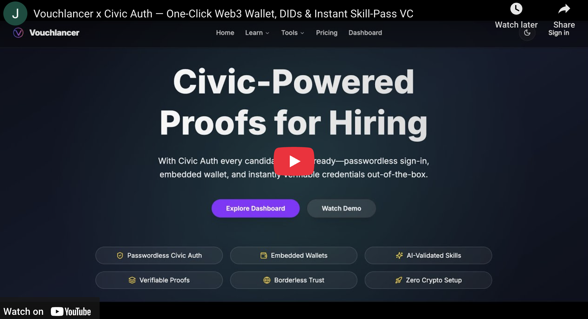

# Vouchlancer — AI‑Assisted Credential‑Backed Hiring powered by **Civic Auth**

Vouchlancer blends friction‑free Civic Auth sign‑in, embedded Web3 wallets and verifiable credentials to deliver a seamless hiring platform for freelancers, recruiters and issuers.
Whether you’re showcasing expertise, signing credentials or streamlining payments, Vouchlancer turns trust into traction.

[](https://youtu.be/a5nw0fbJv2Y)

---

## ✨ Why Vouchlancer?

- **Instant Civic Auth onboarding** — users sign in with Google / Apple and receive an embedded Ethereum wallet in seconds; no extensions or seed‑phrases required.
- **Credential truth at source** — issuers mint VC‑JWT credentials (via Cheqd Studio) that travellers along the hiring pipeline can verify in one click.
- **Payment Links for freelancers** — create branded links that accept one‑off Stripe payments or fixed‑price gigs and track earnings in real time.
- **Stripe subscriptions for teams** — recruiters and organisations upgrade to advanced analytics and multi‑seat access without extra code.
- **Freemium pricing** — unlimited personal usage; pay only for team features or premium AI insights.

---

## 🚀 Quick Start

1. **Clone & install**

   ```bash
   git clone https://github.com/syntaxsurge/vouchlancer.git
   cd vouchlancer
   pnpm install
   ```

2. **Environment file**

   ```bash
   cp .env.example .env
   ```

   | Key                                | Purpose                                             |
   | ---------------------------------- | --------------------------------------------------- |
   | `POSTGRES_URL`                     | PostgreSQL connection string                        |
   | `BASE_URL`                         | Public base URL of your deployment                  |
   | `AUTH_SECRET`                      | JWT signing secret for session cookies              |
   | `STRIPE_SECRET_KEY`                | Stripe secret key                                   |
   | `STRIPE_WEBHOOK_SECRET`            | Stripe webhook signing secret                       |
   | `OPENAI_API_KEY`                   | OpenAI key for AI grading & summaries               |
   | `CHEQD_API_KEY`                    | Cheqd Studio key (used once for credential signing) |
   | `CHEQD_API_URL`                    | Cheqd Studio base URL                               |
   | `NEXT_PUBLIC_PLATFORM_ISSUER_DID`  | Platform DID for system‑issued credentials          |
   | `CIVIC_CLIENT_ID`                  | Civic Auth client ID (server)                       |
   | `NEXT_PUBLIC_CIVIC_AUTH_CLIENT_ID` | Civic Auth client ID (browser)                      |
   | `NEXT_PUBLIC_SOLANA_RPC_ENDPOINT`  | Optional: custom Solana RPC for Civic wallets       |

3. **Database (optional Docker helper)**

   ```bash
   docker compose up -d database   # Postgres 16 on :54322
   pnpm db:reset                   # runs migrations & seeds demo data
   ```

4. **Run Vouchlancer**

   ```bash
   pnpm dev
   ```

   Open <http://localhost:3000>.

---

## 🔐 Civic Auth Integration

Vouchlancer leverages **@civic/auth‑web3** across the stack:

| Layer                | Implementation                                                                                                           |
| -------------------- | ------------------------------------------------------------------------------------------------------------------------ |
| **Sign‑in**          | `<AuthButton>` triggers Civic’s OAuth flow; after redirect we upsert the user and set a secure session cookie.           |
| **Embedded Wallets** | `civic-providers.tsx` wires **wagmi** with `embeddedWallet()` so every authenticated user has a ready‑to‑use EOA wallet. |
| **Auto‑connect**     | `AutoConnect` hook silently attaches the Civic wallet on page load, enabling on‑chain actions without pop‑ups.           |
| **Role gating**      | Server actions call `requireAuth()` which defers rendering until the Civic session cookie is valid.                      |

> Civic Auth removes wallet UX friction, letting the hackathon judging panel experience verifiable credentials and payments without MetaMask or seed‑phrases.

---

## 💸 Payment Links for Freelancers

**New in Vouchlancer**

| Capability            | File / Route                        | Description                                                       |
| --------------------- | ----------------------------------- | ----------------------------------------------------------------- |
| Create / Manage Links | `/candidate/payment-links`          | React dashboard to generate, pause and edit Stripe payment links. |
| Public Checkout       | `/payment/[userId]/[slug]`          | Branded landing page that routes to Stripe Checkout.              |
| API & DB              | `payment-links.ts` schema & queries | Drizzle schema stores earnings, transactions and statuses.        |
| Webhooks              | `api/stripe/webhook`                | Records successful payments and updates freelancer earnings.      |

Freelancers can now monetise skills directly from their profile—share a link, get paid, watch earnings roll in.

---

## 🖥 User Journey Snapshot

### Candidate / Freelancer

- One‑tap Civic Auth sign‑in and DID creation.
- Upload credentials → **UNVERIFIED → PENDING → VERIFIED / REJECTED** lifecycle.
- AI‑graded skill quizzes; passes automatically mint a credential.
- **Share Payment Links** to accept client payments instantly.

### Issuer

- Self‑service onboarding with admin approval.
- Approve / Reject verification requests—approval signs a credential.

### Recruiter

- Full‑text talent search with verified‑only toggle.
- Kanban pipelines and AI fit‑summaries cached per candidate.

### Admin

- Issuer approvals, role upgrades, credential revocation.
- Platform DID rotation, subscription management and pricing updates.

---

## 🧑‍💻 Tech Stack at a Glance

| Layer              | Stack                                                                       |
| ------------------ | --------------------------------------------------------------------------- |
| **Auth & Wallets** | Civic Auth Web3 SDK (embedded EVM & Solana wallets)                         |
| **Credentials**    | Cheqd Studio APIs (mentioned here once)                                     |
| **Frontend**       | Next.js 15 App Router, React Server / Client Components                     |
| **Backend**        | PostgreSQL via Drizzle ORM, Edge runtime middleware, server actions         |
| **Payments**       | Stripe Billing (subscriptions) & Stripe Checkout (freelancer payment links) |
| **AI**             | OpenAI GPT‑4o for grading, summaries and fit analysis                       |

---

## 📂 Codebase Tour

- `app/` – Next.js routes organised by role: `(dashboard)/candidate`, `(dashboard)/recruiter`, etc.
- `components/` – Reusable UI widgets (tables, charts, Civic Auth providers).
- `lib/` – Core logic: auth guards, DB schema, payment‑link queries, AI helpers.
- `public/` – Static assets and screenshots.

---

## 🧠 AI Workflows

| Feature                | Files / Entry Point                                | Model Interaction & Guard‑rails                    |
| ---------------------- | -------------------------------------------------- | -------------------------------------------------- |
| Quiz Grader            | `lib/ai/openai.ts → openAIAssess()`                | Strict 0‑100 integer with JSON validation & retry. |
| Candidate Summary      | `lib/ai/openai.ts → summariseCandidateProfile()`   | 120‑word third‑person bio.                         |
| Recruiter Fit Insights | `lib/ai/openai.ts → generateCandidateFitSummary()` | JSON schema enforcement & cache.                   |

All prompts and validators live in `lib/ai/*`, ensuring deterministic, retry‑safe outputs for scoring and summaries.

---

## 🏆 Hackathon Checklist

- **Civic Auth Excellence** – social login, embedded wallets, server‑side session propagation.
- **Use Case Originality** – combines verifiable credentials, AI insights and one‑click freelancer payments.
- **Go‑to‑Market Readiness** – freemium SaaS with Stripe revenue channels.
- **Presentation** – polished landing, dashboards and demo video.
